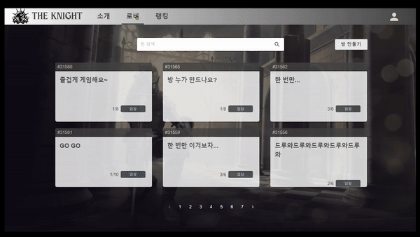
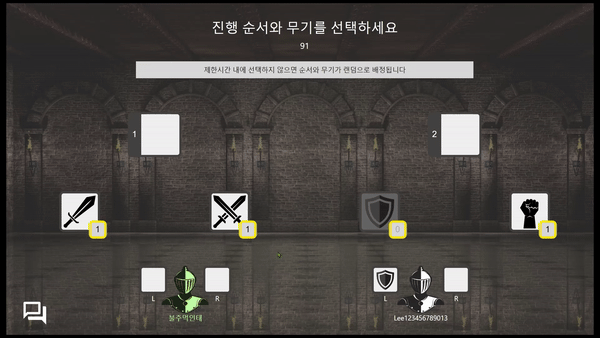
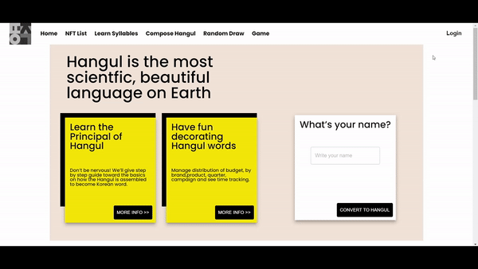
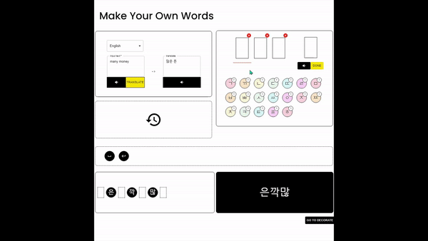
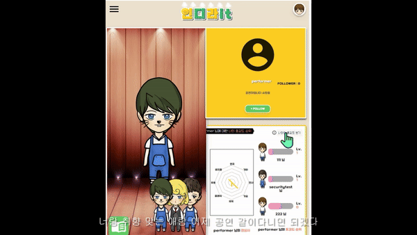

- [Title](#기회는-도전하는-자에게)
- [교육](#교육)
- [프로젝트](#프로젝트-및-경험)
	- [The Knight](#the-knight)
	- [rnmasterpiece](#rnmasterpiece)
	- [인디라it](#인디라it)
  

# 기회는 도전하는 자에게

웹 개발의 최전선에서 사용자와 직접 소통하는 프론트엔드 개발자 박민호 입니다. 
다양한 프로젝트 경험과 지속적인 학습을 통해 성장하고 있습니다. 
 

- 지속적 학습
	- 새로운 기술에 대한 끊임없는 학습
- 협업 능력
	- 팀 프로젝트를 통한 협업 능력 강화
- DX/UX
	- 개발자경험 / 사용자 경험 개선
- 풀스택 역량
	- 프론트엔드를 기반으로 백엔드와 함께 균형 성장
  

# 교육

- 숭실대 글로벌미디어학부 졸업
	- 컴퓨터 공학 기초를 다짐
- 2022 SSAFY(삼성 청년 SW 아카데미) 수료
	- 실무 중심의 SW 개발 역량 강화
- 2023 콘텐츠 창의인재 동반사업
	- 보드게임 개발을 통한 기획력 향상
- 2024 구름 풀스택 교육 수료
	- 프론트엔드부터 백엔드, 배포까지 전반적인 웹 개발 프로세스 학습
  

# 프로젝트 및 경험

	<!--  -->
	
	<!--  -->
	
	<!--  -->
	
	<!--  -->
	
	<!--  -->
	
	<!--  -->
	
	<!--  -->
	
	<!--  -->
	

프론트엔드 기술을 중심으로 풀스택 개발 경험을 쌓아가고 있습니다. 
Javascript, Typescript, React, Redux, Java, Spring Boot, AWS, Docker 등 
다양한 기술을 학습하고 프로젝트에 적용했습니다. 
  

## The Knight

- 심리/전략 실시간 온라인 웹게임
- Javascript, React, Redux, Websocket, SockJS

	
	

- 주요기능
	- 실시간 통신
	- 채팅 시스템
	- 게임 내 기능
- 담당 역할
	- 실시간 통신 : SockJS를 통한 실시간 통신 구현
	- 채팅 시스템 : 전체채팅, 팀채팅 구현
	- 컴포넌트 모듈화 : 재사용성을 위해 아이템, 방 정보 등 모듈화
	- 상태 관리 : Redux, ReduxTollkit을 통한 State관리 및 비동기 처리
  

## rnmasterpiece

- 한글 NFT 발행 및 거래
- Typescript, Web3JS, React, Redux

	
	

- 주요기능
	- 한글 자모음 합성
	- NFT 발행
	- 이더리움 기반 거래
- 담당 역할
	- 한글 처리 기능 : 한글 합성 및 분해 기능 구현, drag & drop 이벤트 처리
	- 컴포넌트 모듈화 : 재사용성을 위한 component 모듈화
	- 상태 관리 : Redux를 통한 효율적인 State 관리
  

## 인디라it

- 인디 공연/전시 홍보 플랫폼 서비스
- Javascript, React

	
	

- 주요기능
	- 아티스트 홍보
	- 피드 소통
	- 아바타 제작
	- 호감도 시스템
- 담당 역할
	- 유저 페이지 : 유저 상호작용에 따른 관심 분포 차트 구현
	- 아바타 시스템 : 아바타 제작 및 호감도 top3 유저 아바타 표시
	- 소통 기능 : Follow, 방명록, 피드댓글/공연댓글 통합
  